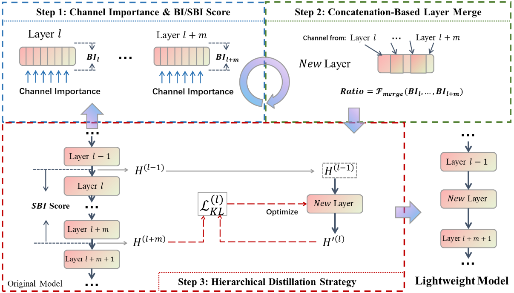

# CoMe

[](https://openreview.net/forum?id=enhFXzKii4)
[](LICENSE)

Official Implementation of the paper "[**Layer as Puzzle Pieces: Compressing Large Language Models through Layer Concatenation**](https://arxiv.org/abs/2510.15304)" (NeurIPS 2025).



## Abstract

Large Language Models excel at natural language processing tasks, but their massive size leads to high computational and storage demands.
Recent works have sought to reduce their model size through layer-wise structured pruning.
However, they tend to ignore retaining the capabilities in the pruned part. 
In this work, we re-examine structured pruning paradigms and uncover several key limitations: 1) notable performance degradation due to direct layer removal, 2) incompetent linear weight layer aggregation, and 3) the lack of effective post-training recovery mechanisms.
To address these limitations, we propose CoMe, including a progressive layer pruning framework with a **Co**ncatenation-based **Me**rging technology and a hierarchical distillation post-training process. 
Specifically, we introduce a channel sensitivity metric that utilizes activation intensity and weight norms for fine-grained channel selection. 
Subsequently, we employ a concatenation-based layer merging method to fuse the most critical channels across adjacent layers, enabling progressive model size reduction. 
Finally, we propose a hierarchical distillation protocol that leverages the correspondences between the original and pruned model layers established during pruning, thereby enabling efficient knowledge transfer.
Experiments on seven benchmarks show that CoMe achieves state-of-the-art performance; when pruning 30\% of LLaMA-2-7b's parameters, the pruned model retains 83\% of its original average accuracy.

## Installation
```bash
git clone [https://github.com/WangFei-2019/CoMe.git](https://github.com/WangFei-2019/CoMe.git)
cd CoMe
conda create -n come python==3.10
conda activate come
pip install -r requirements.txt

```

## Examples

This toolkit supports structured layer pruning for large language models (LLMs) using various state-of-the-art methods. Below is an example command to prune the meta-llama/llama-2-7b-hf model to retain only L layers:

```bash
python main.py --method {METHOD} \
               --model-name {MODEL_NAME} \
               --target-layers L \
               --save-path {SAVE_PATH} \
               --continue-saving \
               --ppl-data {PPL_DATASETS} \
               --seed {SEED} \
               [method-specific arguments]

```

### Arguments

* `--method`: Pruning method. Supported values include: `sleb`, `mka`, `shortgpt`, `reverse`, `taylor`, `magnitude`, `laco`, `concat_merge`.
* `--model-name`: The HuggingFace model name or path (e.g., `meta-llama/llama-2-7b-hf`).
* `--target-layers`: The number of layers to retain after pruning.
* `--save-path`: Directory to save the pruned model and pruning information.
* `--continue-saving`: If set, saves intermediate models at each pruning step.
* `--ppl-data`: Datasets for final perplexity evaluation. Choices: `c4`, `wiki2`.
* `--seed`: Random seed for reproducibility.

Each pruning method supports additional arguments. Below are some examples:

### CoMe (Ours)

```bash
python main.py --method concat_merge \
               --model-name meta-llama/llama-2-7b-hf \
               --target-layers 16 \
               --save-path ./pruned_models/concat_merge \
               --calibration-dataset wiki2 \
               --skip-method bi \
               --nsamples 256 \
               --merge-item 2 \
               --wo-repeat

```

* `--skip-method`: Skip method for calibration. Choices: `bi`, `mka`, `sleb`.
* `--merge-item`: Number of blocks merged per step.
* `--wo-repeat`: If set, avoids repeated calculation of parameter importance.

### Posterior-based CoMe

```bash
python main.py --method concat_merge_P \
               --model-name meta-llama/llama-2-7b-hf \
               --target-layers 16 \
               --save-path ./pruned_models/concat_merge_P \
               --calibration-dataset wiki2 \
               --skip-method bi \
               --nsamples 256 \
               --wo-repeat \
               --granularity 20

```

* `--granularity`: Search granularity.

### SLEB

```bash
python main.py --method sleb \
               --model-name meta-llama/llama-2-7b-hf \
               --target-layers 16 \
               --save-path ./pruned_models/sleb \
               --calibration-dataset wiki2 \
               --nsamples 128

```

### ShortGPT

```bash
python main.py --method shortgpt \
               --model-name meta-llama/llama-2-7b-hf \
               --target-layers 16 \
               --save-path ./pruned_models/shortgpt \
               --calibration-dataset pg19 \
               --nsamples 256

```

### Magnitude/Taylor

```bash
python main.py --method magnitude \
               --model-name meta-llama/llama-2-7b-hf \
               --target-layers 16 \
               --save-path ./pruned_models/magnitude \
               --calibration-dataset wiki2 \
               --nsamples 128 \
               --weight-reduction sum \
               --block-reduction sum \
               --heuristic

```

* `--weight-reduction`: Reduction strategy for weights (sum, mean, max, prob).
* `--block-reduction`: Reduction strategy for blocks (sum, mean, max, prob).
* `--heuristic`: Use the magnitude+ or taylor+ variant.

### MKA

```bash
python main.py --method mka \
               --model-name meta-llama/llama-2-7b-hf \
               --target-layers 16 \
               --save-path ./pruned_models/mka \
               --calibration-dataset mmlu \
               --nsamples 250 \
               --num-tasks 50

```

* `--num-tasks`: Number of categories for manifold alignment.

### Customization

For more details and the full list of arguments, please refer to the source code or run:

```bash
python main.py --help

```

## Cite

This work has been accepted to NeurIPS 2025. If you use this code or our method in your research, please cite our paper:

```plaintext
@inproceedings{wang2025layer,
    title={Layer as Puzzle Pieces: Compressing Large Language Models through Layer Concatenation},
    author={Fei Wang and Li Shen and Liang Ding and Chao Xue and Ye Liu and Changxing Ding},
    booktitle={The Thirty-ninth Annual Conference on Neural Information Processing Systems},
    year={2025},
    url={[https://openreview.net/forum?id=enhFXzKii4](https://openreview.net/forum?id=enhFXzKii4)}
}

```
